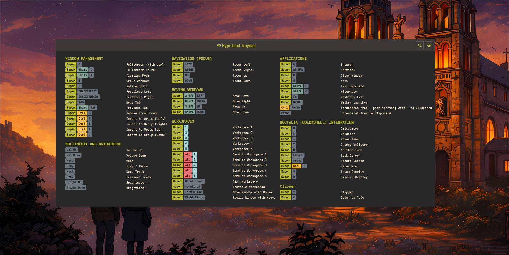

# Keybind Cheatsheet for Noctalia

Universal keyboard shortcuts cheatsheet plugin for Noctalia that **automatically detects** your compositor (Hyprland, Niri or MangoWC) and displays your keybindings with **recursive config parsing**. Supports the classic Hyprland `.conf` format, the new **Hyprland 0.55+ Lua config**, Niri KDL and MangoWC.



## Features

- **Automatic compositor detection** (Hyprland, Niri, MangoWC)
- **Hyprland Lua config support** (Hyprland 0.55+) via `hyprctl binds -j`
- **Recursive config parsing** - follows `source` (Hyprland `.conf`), `require()` (Hyprland Lua) and `include` (Niri) directives
- **Glob pattern support** - parses `~/.config/hypr/*.conf` style includes
- **Without Description section** - binds with no description are surfaced, not dropped; add a custom description or hide them inline
- **Full per-category color customization** - background + text color for every key category, with live preview and clipboard quick-paste
- **Search filter** - type to filter keybindings in the panel
- **Configurable paths & parser mode** - custom config locations and forced Lua/conf parser in settings
- **Smart key formatting** - XF86 keys display as readable names (Vol Up, Bright Down, etc.)
- **Flexible column layout** (1-4 columns) with auto-height
- **IPC support** - `toggle` and `refresh` for global hotkeys

## Supported Compositors

| Compositor | Default Config | How it's read |
|------------|----------------|----------------|
| **Hyprland 0.55+** | `~/.config/hypr/hyprland.lua` | `hyprctl binds -j` (live, already-evaluated binds) |
| **Hyprland (classic)** | `~/.config/hypr/hyprland.conf` | hyprlang `.conf` text parser (recursive) |
| **Niri** | `~/.config/niri/config.kdl` | KDL parser (recursive `include`) |
| **MangoWC** | `~/.config/mango/config.conf` | `bind=` / `axisbind=` / `mousebind=` parser |

## Installation

```bash
cp -r keybind-cheatsheet ~/.config/noctalia/plugins/
```

## Usage

### Bar Widget
Add the plugin to your bar configuration in Noctalia settings. Click the keyboard icon to open the cheatsheet.

### Global Hotkey

**Hyprland:**
```bash
bind = $mod, F1, exec, qs -c noctalia-shell ipc call plugin:keybind-cheatsheet toggle
```
You can set your custom Super key variable (e.g. `$mainMod`) in the plugin settings.

**Niri:**
```kdl
binds {
    Mod+F1 { spawn-sh "qs -c noctalia-shell ipc call plugin:keybind-cheatsheet toggle"; }
}
```

**MangoWC:**
```bash
bind=SUPER,F1,spawn,qs -c noctalia-shell ipc call plugin:keybind-cheatsheet toggle
```

### IPC Commands

| Command | Effect |
|---------|--------|
| `qs -c noctalia-shell ipc call plugin:keybind-cheatsheet toggle` | Open / close the cheatsheet panel |
| `qs -c noctalia-shell ipc call plugin:keybind-cheatsheet refresh` | Force a re-parse of your keybindings |

`refresh` is useful after editing your config — bind it to a key to reload without restarting the shell.

## Hyprland Lua Config (0.55+)

Hyprland 0.55 replaced the static hyprlang `.conf` with a **Lua config** (`hyprland.lua`). Binds can now be generated with `require()`, `for` loops and runtime logic, so they **cannot be recovered by reading the file as text**.

### How it works

Instead of parsing the Lua file, the plugin asks Hyprland directly:

1. **Authoritative bind list** — runs `hyprctl binds -j` and reads the already-evaluated JSON bind list. This correctly handles `require()` modules, `for` loops and multi-key chords — whatever Hyprland *actually* has bound at runtime.
2. **Category & description recovery** — the plugin then *lightly scans* `hyprland.lua` and every file it pulls in via `require()` to recover human-readable structure:
   - **Category headers**: a comment in the form `-- N. NAME` (e.g. `-- 1. Applications`)
   - **Static descriptions**: a `description = "..."` (or `desc = '...'`) literal maps that exact description to the current category
   - **Loop-generated descriptions**: a concatenated literal such as `description = "Workspace " .. i` is treated as a *prefix* — any bind whose description starts with `Workspace ` is filed under that category
3. Binds whose description can't be matched fall into a generic **Other** category; binds with no description at all go to the **Without Description** section (see below).

You don't need to change your Lua config — just keep using `-- N. NAME` comment headers and `description = "..."` fields where you want grouping.

**Example Lua structure the scanner understands:**
```lua
-- 1. Applications
Hyprland.config.bind("$mod, T", function() ... end, { description = "Terminal" })
Hyprland.config.bind("$mod, B", function() ... end, { description = "Browser" })

-- 2. Workspaces
for i = 1, 9 do
  Hyprland.config.bind("$mod, " .. i, function() ... end,
    { description = "Workspace " .. i })   -- prefix "Workspace " -> category "Workspaces"
end

require("keybinds")   -- followed and scanned recursively
```

### Parser mode

A **Parser Mode** setting controls which Hyprland parser is used:

| Mode | Behavior |
|------|----------|
| `auto` *(default)* | Use the Lua parser if `hyprland.lua` exists, otherwise fall back to the `.conf` parser |
| `lua` | Always use `hyprctl binds -j` (Lua parser) |
| `conf` | Always use the classic `.conf` text parser |

The legacy hyprlang `.conf` parser is **kept unchanged** as a fallback for users still on hyprlang configs.

## Without Description Section

Binds with no description are no longer silently dropped. They appear in a dedicated **Without Description** section where you can:

- **Add a custom description** inline — it is remembered and displayed like any other bind
- **Hide** a bind you don't care about

Overrides are keyed by a **stable bind identity** (`submap | modmask | key | flags | dispatcher`) that deliberately excludes Hyprland's unstable internal Lua registry reference, so your custom descriptions and hidden binds **survive Hyprland restarts**.

Settings provide a **"Show binds without a description"** toggle, plus **"Restore hidden"** and **"Clear all overrides"** actions.

## Config Format

### Hyprland (classic `.conf`)

Recursively parses your main config and all `source` includes.

```bash
# 1. APPLICATIONS
bind = $mainMod, T, exec, alacritty #"Terminal"
bind = $mainMod, B, exec, firefox #"Browser"

# 2. WINDOW MANAGEMENT
bind = $mainMod, Q, killactive, #"Close window"
bind = $mainMod, F, fullscreen, #"Toggle fullscreen"
```

- Categories: `# N. CATEGORY NAME` (N is a number)
- Descriptions: `#"description"` at end of the bind line
- `source = ~/.config/hypr/keybinds.conf` and globs like `source = ~/.config/hypr/apps/*.conf` are followed automatically

### Niri

Parses the `binds { }` block and follows all `include` directives.

```kdl
binds {
    // #"Applications"
    Mod+T hotkey-overlay-title="Terminal" { spawn "alacritty"; }

    // #"Window Management"
    Mod+Q hotkey-overlay-title="Close window" { close-window; }

    // #"Workspaces"
    Mod+1 { focus-workspace 1; }
}
```

- Categories: `// #"Category Name"` (exact format)
- Descriptions: `hotkey-overlay-title="description"` attribute
- Without descriptions, actions are auto-categorized by type (see table below)
- `include "~/.config/niri/binds.kdl"` is followed automatically

### MangoWC

Parses `bind=`, `axisbind=` and `mousebind=` directives from `~/.config/mango/config.conf`.

```bash
# Applications
bind=SUPER,T,spawn,alacritty #"Terminal"
bind=SUPER,B,spawn,firefox #"Browser"

# Window Management
bind=SUPER,Q,killclient, #"Close window"
```

- Categories: standalone `# Category Name` comment lines
- Descriptions: trailing `#"description"` on a bind line
- Modifier aliases recognized: `LOGO` = `SUPER`, `MOD1` = `ALT`
- XF86 media keys are formatted (Vol Up, Mute, Bright Up/Down, …)
- Lines without a preceding `# Category` use the localized default category

## Auto-Categorization (Niri)

When no category comment is provided, keybindings are grouped by action:

| Action prefix | Category |
|---------------|----------|
| `spawn` | Applications |
| `focus-column-*` | Column Navigation |
| `focus-window-*` | Window Focus |
| `focus-workspace-*` | Workspace Navigation |
| `move-column-*` | Move Columns |
| `move-window-*` | Move Windows |
| `close-window`, `fullscreen-window` | Window Management |
| `maximize-column` | Column Management |
| `set-column-width` | Column Width |
| `screenshot*` | Screenshots |
| `power-off-monitors` | Power |
| `quit` | System |

## Special Key Formatting

| Raw Key | Display |
|---------|---------|
| `XF86AudioRaiseVolume` | Vol Up |
| `XF86AudioLowerVolume` | Vol Down |
| `XF86AudioMute` | Mute |
| `XF86MonBrightnessUp` | Bright Up |
| `XF86MonBrightnessDown` | Bright Down |
| `Print` | PrtSc |
| `Prior` / `Next` | PgUp / PgDn |

## Color Customization

Every key category has independently themeable **background** and **text** colors:
`Super`, `Ctrl`, `Shift`, `Alt`, `XF86`, `Print`, numeric, mouse and default letter keys — plus the description text color.

- **Two-pill rows** per category: left pill = background, right pill = label text on that background. Click a pill to open the color picker.
- **Theme-aware defaults**: `Super` / `Ctrl` / `Shift` use an empty sentinel meaning "use the Material theme accent" (`mPrimary` / `mSecondary` / `mTertiary`), so themed setups stay untouched unless you deliberately override.
- **Clipboard quick-paste**: copy a `#RRGGBB` / `#RRGGBBAA` hex and a paste icon appears in each pill — one click applies it (clipboard polled via `wl-paste`).
- **Live preview + revert**: changes preview immediately; closing Settings without Save restores the snapshot taken when the panel opened.
- **Per-row reset** and a **"Reset all colors"** action restore theme defaults.

## Settings

Access settings via the gear icon in the panel header:

- **Window width / height** (auto or manual) and **column count** (1-4)
- **Hyprland config path** — classic `.conf` location
- **Hyprland Lua path** — `hyprland.lua` location (0.55+)
- **Parser mode** — `auto` / `lua` / `conf`
- **Niri config path** / **MangoWC config path**
- **Show binds without a description** toggle + **Restore hidden** / **Clear all overrides**
- **Merge sequential binds** and **split large workspace category** (threshold configurable)
- **Per-category colors** — background + text for every category, with clipboard paste and reset
- **Refresh** — force reload keybindings

## Troubleshooting

### "Loading..." stays forever
1. Check the compositor is detected: look for logs tagged `[KeybindCheatsheet]`
2. Verify the config file exists at the configured path
3. On Hyprland 0.55+, confirm `hyprctl binds -j` works in your terminal

### `hyprctl` error shown in the panel
The Lua parser depends on `hyprctl binds -j`. Ensure Hyprland is running and `hyprctl` is on your `PATH`, or force the classic parser by setting **Parser mode** to `conf`.

### No categories found
- **Hyprland `.conf` / MangoWC:** categories must be `# 1.` / `# Category Name` comment lines
- **Hyprland Lua:** add `-- N. NAME` headers and `description = "..."` fields in `hyprland.lua` (and `require()`d modules)
- **Niri:** use `// #"Category Name"` format

### Binds missing or under "Without Description"
On Lua configs, descriptions are matched from `description = "..."` literals against the live `hyprctl` binds. Loop-generated binds need a concatenated prefix literal (e.g. `"Workspace " .. i`). Anything unmatched lands in **Without Description**, where you can add a description or hide it.

### Keybinds from included files not showing
The plugin follows `source` (Hyprland `.conf`), `require()` (Hyprland Lua) and `include` (Niri) directives automatically. Check logs to see which files are parsed.

## Requirements

- Noctalia Shell 3.6.0+
- Hyprland (classic `.conf` or 0.55+ Lua), Niri, or MangoWC
- `hyprctl` on `PATH` for Hyprland Lua configs
- `wl-paste` (wl-clipboard) for the color clipboard quick-paste feature

## License

MIT
